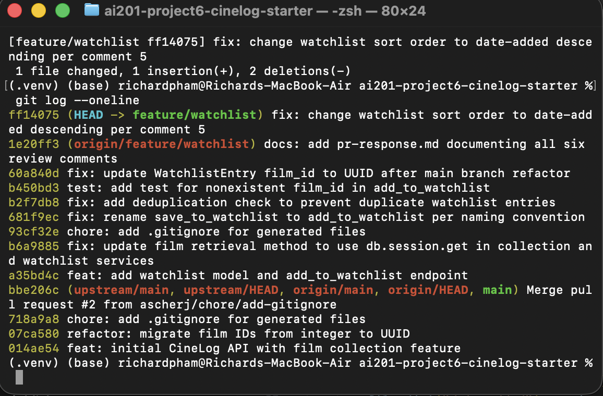

# PR Response Doc — CineLog Watchlist Feature

## AI Usage
<!-- Fill in at the end — how you used AI tools during this project -->

## Comment 1 — Rename
**What I did:**
Renamed `save_to_watchlist()` to `add_to_watchlist()` in `services/watchlist_service.py`. Updated the docstring's first line from "Save a film..." to "Add a film..." to match. Found and updated the one call site in `routes/watchlist/watchlist.py` (the import statement and the call inside `add_film()`). Did a project-wide search for `save_to_watchlist` afterward to confirm no other references remained.

**How I verified:**
Ran `python -m pytest tests/ -v` after the rename to confirm nothing broke (no watchlist tests existed yet at this point, so this mainly caught import/syntax errors). Manually re-checked `routes/watchlist/watchlist.py` and `services/watchlist_service.py` to confirm both the function definition and the call site were updated consistently.

## Comment 2 — Deduplication
**What I did:**
Added a deduplication check to `add_to_watchlist()`, mirroring the pattern in `add_to_collection()`: after the existing film-existence check, query for a `WatchlistEntry` with the same `user_id` and `film_id`; if one exists, raise a new `AlreadyInWatchlistError` instead of creating a duplicate. Defined `AlreadyInWatchlistError` in `watchlist_service.py`, following the same local-exception convention used in `collection_service.py`. Also updated the docstring's `Raises:` section to document the new exception.

***Things to Note***
1. collection_service.py defines AlreadyInCollectionError. There's no equivalent exception in watchlist_service.py yet

2. Unlike CollectionEntry, WatchlistEntry in models.py has no UniqueConstraint on (user_id, film_id). relies purely on the app-level check here

**How I verified:**
Ran `python -m pytest tests/ -v` to confirm the existing suite still passed. (Comment 3's dedicated test for this behavior comes next.)

## Comment 3 — Missing test
**What I did:**
Created `tests/test_watchlist.py`, modeled on `test_add_to_collection_nonexistent_film_raises` from `test_collection.py`. Duplicated the `app` and `sample_user` fixtures (no `conftest.py` exists in `tests/`, so per-file fixture duplication matches the existing convention). Wrote `test_add_to_watchlist_nonexistent_film_raises`, asserting that `add_to_watchlist()` raises `FilmNotFoundError` for a film_id that doesn't exist.

One deliberate deviation from the model test: `test_collection.py` uses a UUID-shaped fake ID (`"00000000-0000-0000-0000-000000000000"`), but `Film.id` in the current pre-refactor schema is still an integer (`add_to_watchlist()`'s own docstring notes this). I used `999999` instead, since that's honest about today's data model — a UUID-shaped string would likely just fail to match any row in SQLite's loosely-typed comparison and pass "by accident" rather than by design. I'll need to revisit this fake ID once Comment 6's rebase migrates `Film.id` to a UUID.

**How I verified:**
Ran `python -m pytest tests/test_watchlist.py -v` to confirm the new test passes in isolation, then `python -m pytest tests/ -v` to confirm the full suite (collection + watchlist) still passes together.

## Comment 4 — Default visibility
**My position:**
I would keep `public=True` as the default for new watchlist entries.

**Reasoning:**
Addressing the original comment left in the open PR, this was an intentional design choice in line with the perceived purpose of the application. CineLog is designed as a social film-tracking application, so I am optimizing for the common behavior of saving a film and having that activity contribute to discovery. Leaving the watchlist public by default lets other users see what someone plans to watch without requiring an extra visibility choice or something every time a film is added. That keeps the main action lightweight and makes the feature useful as a social signal rather than only as a private bookmark list.

This default also avoids a state where most watchlists are invisible simply because users never find or change a privacy control. The visibility field still gives users a way to make individual entries private when they don't want to share them, so the default supports the product's social use without removing user control.

**Tradeoff acknowledged:**
The downside is that leaving it public can surprise users who think of a watchlist as a personal planning data. A privacy-first default of `public=False` would protect against accidental sharing and would be the safer choice for an application where privacy is the primary expectation. I still prefer `public=True` here because the application is kind of social media and the value of shared watchlists depends on participation, but the UI should clearly indicate the visibility state and make changing it easy.

## Comment 5 — Sort order
**My position:**
I would change `get_watchlist()` to return entries by `date_added` descending, so the most recently added film appears first.

**Reasoning:**
A watchlist is usually a changing queue of viewing intent rather than a reference catalog. When users open it, the most useful context is often the films they recently decided they wanted to watch. Newest-first preserves that context and makes the result of the most recent “add to watchlist” action immediately visible. It also matches the ordering already used by the collection service, which allows both list to be on the same page in terms of ordering.

Alphabetical order is predictable and makes it easier to locate a specific title in a long list, but it removes the history of how the watchlist was built. It can also make a newly added film appear somewhere in the middle of the page, which weakens the feedback that the add action succeeded.

**Engagement with reviewer's point:**
I agree with the maintainer's reasoning that date-added order better reflects how users interact with a watchlist. The list is not just a directory of titles; it represents current interest, and recency is meaningful information. I would therefore implement `WatchlistEntry.date_added.desc()` as the default ordering. If alphabetical browsing becomes important later, it would be better exposed as an explicit sort option rather than used as the only default.

## Comment 6 — Rebase
**What conflicted:**
Running `git rebase origin/main` produced a textual conflict in `.gitignore` (both branches had independently created one). There was also a non-textual conflict: main's refactor changed `Film.id` from `db.Integer` to `db.String(36)` (UUID), but `WatchlistEntry.film_id` — which only exists on my feature branch — still referenced it as `db.Integer`. Git didn't flag this as a conflict since `WatchlistEntry` doesn't exist on `main` at all, so there was no overlapping text for git to compare — but it left the foreign key type mismatched with the column it references.

**How I resolved it:**
For `.gitignore`, I merged both versions' entries (my branch's `.pytest_cache/` line plus main's existing entries) into a single de-duplicated file. For the UUID mismatch, I manually updated `WatchlistEntry.film_id` to `db.Column(db.String(36), db.ForeignKey("film.id"), nullable=False)` to match the refactored `Film.id` type. I also updated `tests/test_watchlist.py`'s fake film ID back to a UUID-shaped string (`"00000000-0000-0000-0000-000000000000"`), since I'd previously changed it to an integer (`999999`) to be accurate to the pre-refactor schema — post-rebase, a UUID-shaped fake ID is the version that matches the current data model.

Midway through, an accidental `git pull` merged my already-pushed remote branch back into my freshly-rebased local branch, introducing a merge commit and duplicate commits. I used `git rebase --onto <commit-before-merge> <merge-commit> feature/watchlist` to drop the merge commit and replay only the new work cleanly on top of the already-rebased history.

**How I verified no conflict remains:**
Ran `python -m pytest tests/ -v` after the fix — all 5 tests passed, including the watchlist test against the corrected UUID type. Ran `git log --oneline --graph` to confirm the final branch history is a single linear sequence on top of main, with no merge commits introduced by my own branch.

## PR Description
<!-- Written at the end — feature overview, design decisions, manual testing steps -->
